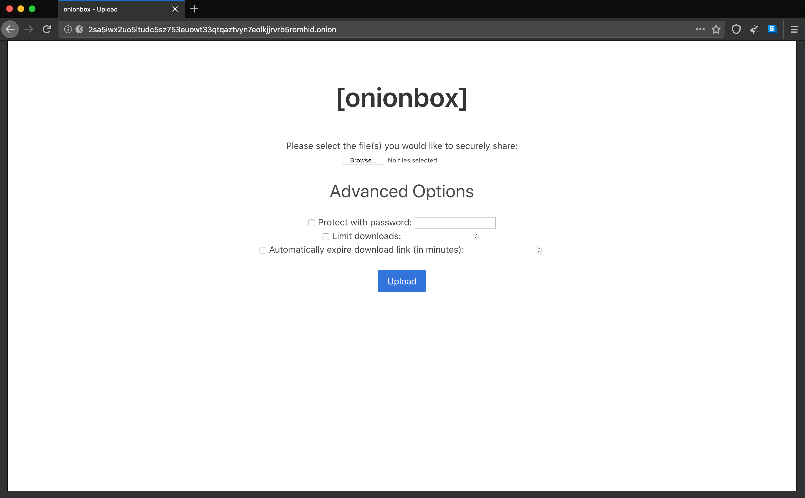
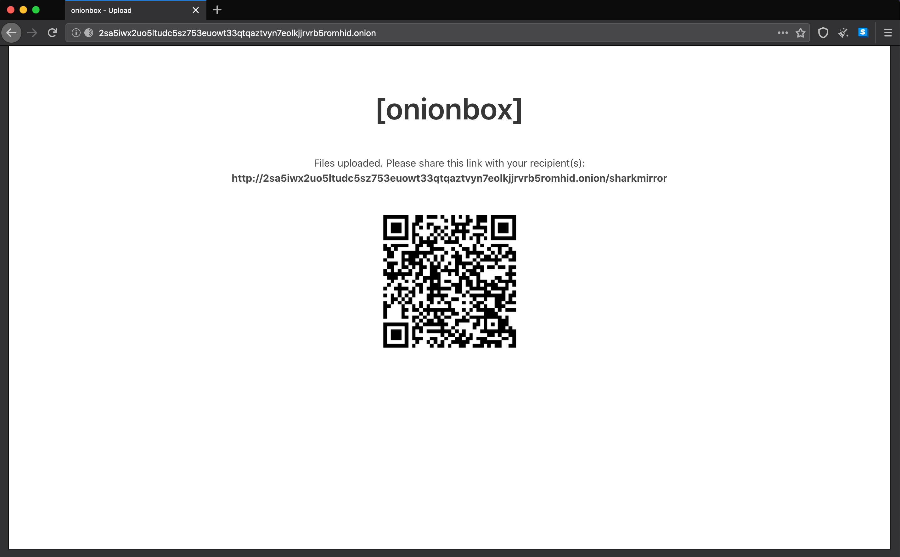

# onionbox  [](https://coveralls.io/github/ciehanski/onionbox?branch=master) [](https://goreportcard.com/report/github.com/ciehanski/onionbox) [](https://app.fossa.com/projects/git%2Bgithub.com%2Fciehanski%2Fonionbox?ref=badge_shield)

A basic implementation of [OnionShare](https://github.com/micahflee/onionshare) in Go.
Mostly built as a fun project, onionbox is still a WIP so usage is not guaranteed secure, *yet*.

#### Key Features:
- All files are stored in memory and *never* written to disk. The bytes from
each uploaded file are written to an individual **zip buffer** (in memory, and also compressed 😄) and then written directly
to the response for download. Zip was chosen since it is the most universal archiving
standard that is supported by all operating systems.
- You have the ability to encrypt the uploaded files' bytes if
the content is extra sensitive. AES-GCM-256 is used for encryption. This means, while stored in memory, the files' bytes
will be encrypted as well. **If password encryption is enabled, recipients will need to enter the correct password 
before the download.**
- You have the ability to limit the number of downloads per download link
generated.
- You have the ability to enforce that download links automatically expire after a specific duration of your choosing.
- 2-way file sharing. For instance, if you are the recipient of confidential information 
but the sender is not technically-savvy, you yourself can run an onionbox server, send them the 
generated .onion URL and have them upload the files directly for you to download.
- Can be run in a Docker container, or locally on your host machine. You could
of course deploy onionbox to any cloud provider of your choosing.
- Static binary! Woo!




## TODO:
- [ ] Implement more tests
- [ ] Android support (build almost working)
- [ ] Windows support
- [x] ARM support
- [x] QR Code Generation
- [ ] Add another mode supporting cli-only upload from disk

## Build/Install

The easiest way to install `onionbox` will be to download the applicable binary
from the [releases](https://github.com/ciehanski/onionbox/releases) section. You can also install if you have the [Go toolchain](https://golang.org/dl/)
installed and if you are running a flavor of Linux. This will not work with Windows or macOS. This will take a long time, roughly ~10 minutes. You can build from source with the `Makefile`:

```bash
$ git clone https://github.com/ciehanski/onionbox .
$ cd onionbox && make build
```

## Usage

Once you have the `onionbox` binary simply make it executable and run it with the various flags
provided:

```bash
$ chmod +x onionbox
$ ./onionbox -lport 8080 -debug

    -lport <int> : tell onionbox which port to make your onion service locally
    run on.

    -rport <int> : tell onionbox which port to make your onion service remotely
    available on.

    -torv3 <bool> : tell onionbox to run on torv3 or torv2.

    -torrc <string> : utilize a custom Torrc file to run your onion service.

    -debug <bool> : tell onionbox to print debug logs or silence logs.
```

## Contributing:

Contributions and PRs are welcome!

You can get started by either forking or cloning the repo. After, you can get started
by running:

```bash
make run
```

This will go ahead and build everything necessary to interface with Tor. After compose
has completed building, you will have a new `onionbox` container which will be your
dev environment.

Anytime a change to a .go or .mod file is detected the container will rerun with
the changes you have made. You must save in your IDE or text editor for the 
changes to be picked up. It takes roughly ~35 seconds for onionbox to restart after 
you have made changes.

You can completely restart the build with:
```bash
make restart
```

Run tests:
```bash
make exec
make test
```

Get container logs:
```bash
make logs
```

Shell into docker container:
```bash
make exec
```

Lint the project:
```bash
make lint
```

## License:
- AGPLv3

[](https://app.fossa.com/projects/git%2Bgithub.com%2Fciehanski%2Fonionbox?ref=badge_large)
